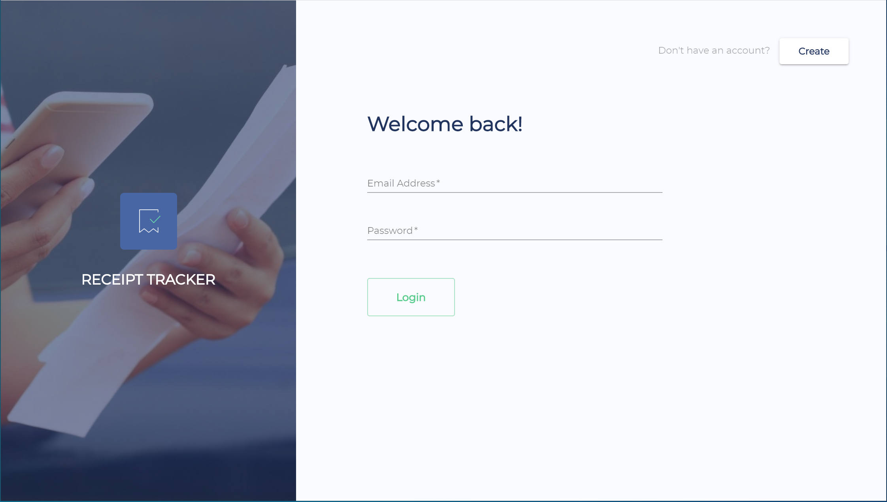
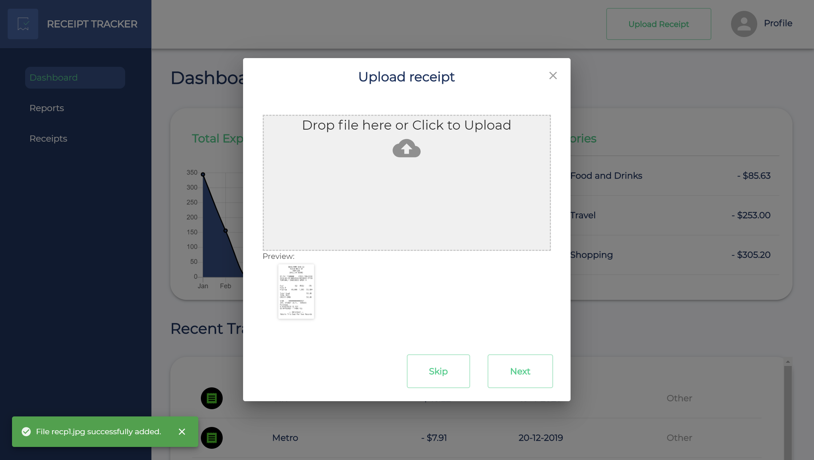
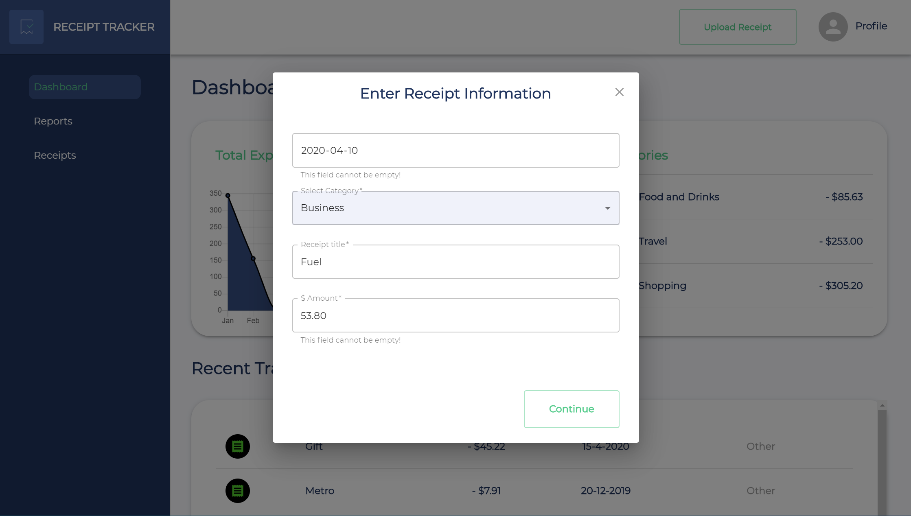
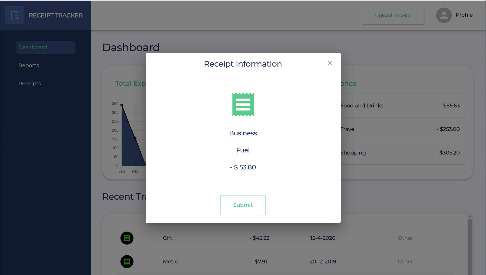
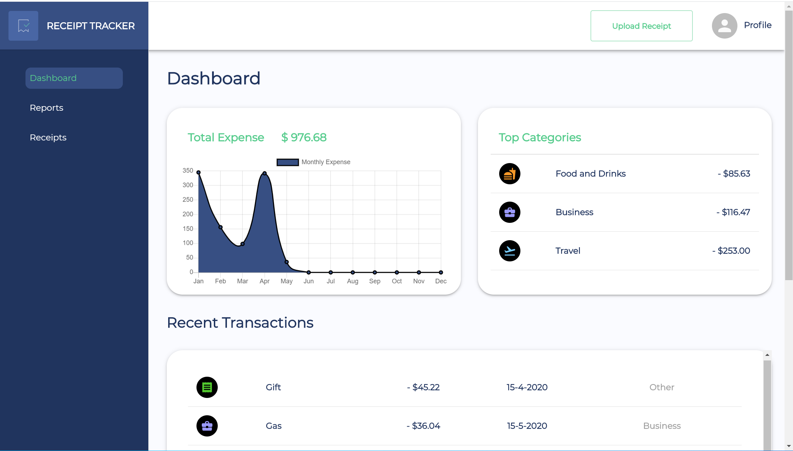
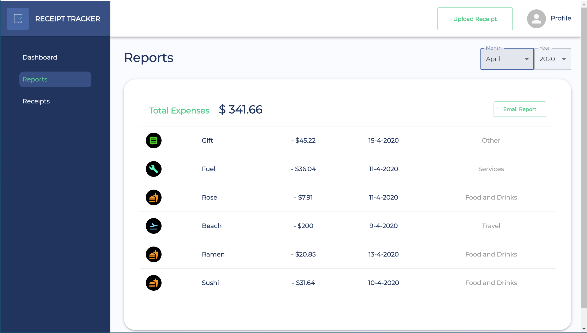
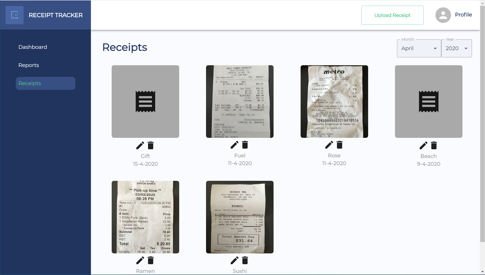
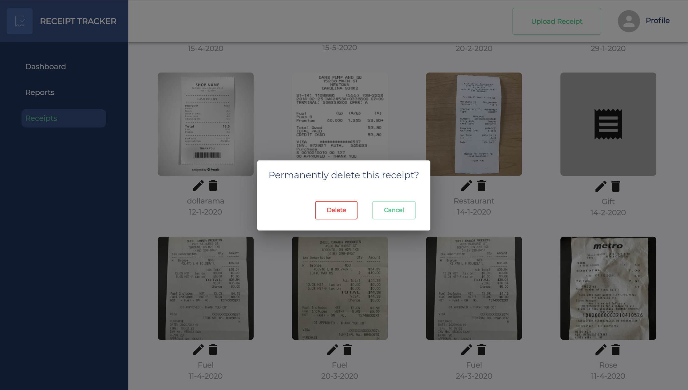

# Receipt Tracker

Receipt tracker is a web application that allows user to manage there expences by uploading images of paper receipts and keeping track of there daily, monthly and yearly expences.

## Contributors

[Punam Sonawane](https://github.com/PunamSonawane), [Hitiksha Panchal](https://github.com/HitikshaPanchal)

## Tech/Framework

Our Stack:

- React.js/Material UI
- Python/Flask
- MongoDB
- AWS S3 buckets
- Google-cloud-vision-API
- Boto3
- JWT
- SendGrid
- Bcrypt
- Chart.js

# Installations

1. Add API Key Dependencies to the project (see **Adding API Key Dependencies** below for instructions)
2. cd to the client directory (front-end)
3. Install dependencies via `npm install`
4. start the app via `npm start`
5. Head to http://localhost:3000 on the browser
6. cd to the server directory (back-end)
7. Install dependencies via `pipenv install`
8. run server via `pipenv run flask run`
9. server will run on http://localhost:5000

### Adding API Key Dependencies

This program requires the following API keys.
These can be obtained here (follow the instructions on the website links):

- [Google-cloud-vision-API](https://cloud.google.com/vision/docs)
- [Sendgrid API](https://sendgrid.com/docs/for-developers/sending-email/)

1. Add a `.env` file under `server/` with a key-value pairs.
    
    
   Note:
    
   `FLASK_ENV="development"`
    

# Features

### Feature Overview

- SignUp/Login User
- Create Receipts
- Dashboard features
- Report features
- Receipts features
 

### Feature Description

- **Signuo/Login:** User can Signup/login from this startup page.
  
   
- **Create/Upload Receipts:** User can upload the receipt image, then with help of google-cloud-vision-API it will extract the text from image and Machine learning model will extract the title and amount from the image. On next page we can manually add date, category.
  
   
  
   
  
- **Dashboard feature:** In Dashboard user can see total expences by month in graphical way. Top most expences by category and recent transaction(receipts)
  
   
- **Report feature:** User can see there expences in report format. User can filter it by month and year. If user wants there monthly expence report in csv format, then with the help of email button requested monthly report will be sent to users registerd email address.
  
   
- **Receipt feature:** User can see, edit and delete the receipts.
  
   
  
   

  
